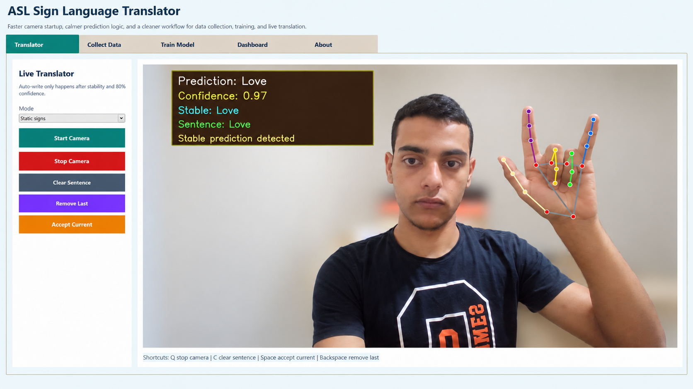
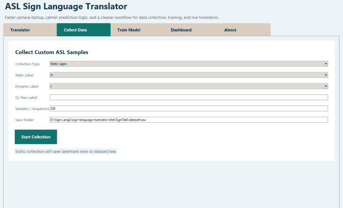
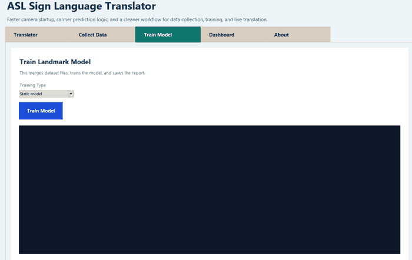

<div align="center">

# Sign Language Translator

**Desktop machine-learning application for collecting sign-language data, training recognition models, and translating signs from a webcam in real time.**

Python · OpenCV · MediaPipe · scikit-learn · TensorFlow

</div>



---

## Overview

Sign Language Translator is an end-to-end **American Sign Language (ASL) recognition project** that combines computer vision, machine learning, deep learning, and a desktop GUI.

The project includes the complete workflow:

**Collect data → Train models → Evaluate performance → Run real-time translation**

It supports static hand-shape recognition, an experimental dynamic-sign pipeline, and a hybrid recognition mode.

## Application Preview

The screenshot above shows the real-time recognition workflow with MediaPipe hand landmarks, model prediction, confidence, stability checking, and accepted output.

### Data Collection



### Model Training



---

## Key Results

| Metric | Result |
| --- | ---: |
| Static recognition classes | **25** |
| Landmark samples | **23,300** |
| Training samples | **7,800** |
| Validation samples | **7,500** |
| Test samples | **8,000** |
| Validation accuracy | **94.81%** |
| Session-based test accuracy | **93.49%** |

The static model was evaluated with a **session-based GroupShuffleSplit**, keeping samples from the same recording session together instead of randomly mixing them across train and test sets.

This makes the reported test result more meaningful than a simple random row split for this dataset.

> **Evaluation note:** the current dataset still comes from a limited number of recording sessions/users. Performance on completely unseen users and environments may be lower than the reported session-based result.

The full confusion matrix and per-class precision, recall, and F1 scores are available in [`models/training_report.txt`](models/training_report.txt).

---

## What the Application Can Do

### Real-Time Recognition

The translator captures webcam frames with OpenCV, detects a hand with MediaPipe, extracts **21 hand landmarks × 3 coordinates**, and sends the normalized landmark representation to the selected recognition pipeline.

To reduce unstable predictions, the application includes:

- confidence thresholds
- prediction history
- majority voting
- stability checks across multiple frames
- automatic acceptance after a stable high-confidence prediction
- manual controls for accepting, removing, or clearing translated output

### Recognition Modes

**Static mode**  
Recognizes signs from a single hand pose using a trained Random Forest classifier.

**Dynamic mode**  
Processes sequences of hand landmarks with a recurrent neural-network pipeline for motion-dependent signs.

**Hybrid mode**  
Uses detected hand motion to switch between the static and dynamic recognition pipelines.

### Integrated Data Collection

The project contains built-in workflows for collecting:

- static landmark samples
- dynamic landmark sequences

The collected data can be used to extend the dataset and retrain the models without creating a separate data-collection application.

### Integrated Training

Training can be launched directly from the desktop application or from the CLI.

The static training pipeline:

1. loads recorded landmark sessions
2. keeps session groups separated during train/validation/test splitting
3. encodes the class labels
4. trains a `RandomForestClassifier`
5. evaluates the model
6. saves the trained model, label encoder, confusion matrix, and classification report

---

## Recognition Pipeline

```text
Webcam
   │
   ▼
OpenCV Frame Capture
   │
   ▼
MediaPipe Hand Detection
   │
   ▼
21 Hand Landmarks × 3 Coordinates
   │
   ├────────────── Static Mode ──────────────┐
   │                                          ▼
   │                                Random Forest Model
   │                                          │
   │                                          ▼
   │                                  Stable Prediction
   │
   └───────────── Dynamic Mode ──────────────┐
                                              ▼
                                     Landmark Sequence
                                              │
                                              ▼
                                      Recurrent Model
                                              │
                                              ▼
                                      Motion Prediction
```

---

## Dynamic Recognition Status

The dynamic-sign pipeline is included as an **experimental prototype**.

The current dynamic training report contains only **30 sequences across two recorded labels**, so its 100% validation/test result is **not treated as a reliable generalization metric**. The training report itself flags possible overfitting or data leakage.

See [`models/dynamic_training_report.txt`](models/dynamic_training_report.txt) for the current experimental results.

---

## Tech Stack

| Area | Technologies |
| --- | --- |
| Language | Python 3.11 |
| Computer Vision | OpenCV, MediaPipe |
| Machine Learning | scikit-learn, Random Forest |
| Deep Learning | TensorFlow / Keras |
| Data | NumPy, Pandas |
| Model persistence | Joblib |
| Interface | Python desktop GUI, Pillow |

---

## Project Structure

```text
sign-language-translator/
├── assets/
│   └── screenshots/
├── dataset/
│   ├── raw/
│   ├── processed/
│   └── sequences/
├── models/
│   ├── sign_model.pkl
│   ├── label_encoder.pkl
│   ├── dynamic_sign_model.keras
│   ├── dynamic_sign_labels.json
│   ├── training_report.txt
│   └── dynamic_training_report.txt
├── src/
│   ├── collect_data.py
│   ├── collect_sequence_data.py
│   ├── train_model.py
│   ├── train_sequence_model.py
│   ├── real_time_translate.py
│   ├── real_time_dynamic_translate.py
│   ├── evaluate_live_session.py
│   ├── gui_app.py
│   ├── config.py
│   └── utils.py
├── main.py
├── requirements.txt
└── README.md
```

---

## Installation

Python **3.11** is recommended for compatibility with the TensorFlow version used by the project.

```bash
git clone https://github.com/R3Dzf/sign-language-translator.git
cd sign-language-translator

python -m venv signlang-env
```

Activate the environment on Windows:

```powershell
.\signlang-env\Scripts\activate
```

Then install the dependencies:

```bash
python -m pip install --upgrade pip
pip install -r requirements.txt
```

---

## Run the Application

### Desktop GUI

```bash
python main.py
```

The GUI provides access to translation, data collection, model training, model statistics, and project information.

### CLI

```bash
python main.py --cli
```

The CLI includes:

1. Collect static data
2. Train static model
3. Run static translator
4. Collect dynamic sequence data
5. Train dynamic model
6. Run dynamic translator
7. Run hybrid translator

---

## Keyboard Shortcuts

While using the translator:

| Key | Action |
| --- | --- |
| `Q` | Stop camera |
| `C` | Clear sentence |
| `Space` | Accept current prediction |
| `Backspace` | Remove the last accepted prediction |

---

## Current Limitations

- The static dataset is based on a limited number of recording sessions/users.
- Similar hand shapes can still be confused; the current report shows weaker performance for some visually similar classes.
- The current implementation tracks one hand at a time.
- Dynamic recognition is experimental and needs substantially more data.
- Continuous sentence-level sign-language understanding is not yet implemented.

---

## Engineering Value

This project demonstrates an end-to-end machine-learning workflow rather than only model training.

It combines:

- dataset collection
- feature extraction
- grouped evaluation
- classical machine learning
- sequence-based deep learning
- real-time computer vision
- prediction stabilization
- desktop application development

The goal is to connect the ML pipeline to a usable real-time application while keeping the evaluation limitations visible.

---

## Author

**Ahmed Youssef Bosha**  
Computer & Control Engineering — Tanta University

- **Email:** [ahmedyoussefmansourbosha@gmail.com](mailto:ahmedyoussefmansourbosha@gmail.com)
- **GitHub:** [github.com/R3Dzf](https://github.com/R3Dzf)
